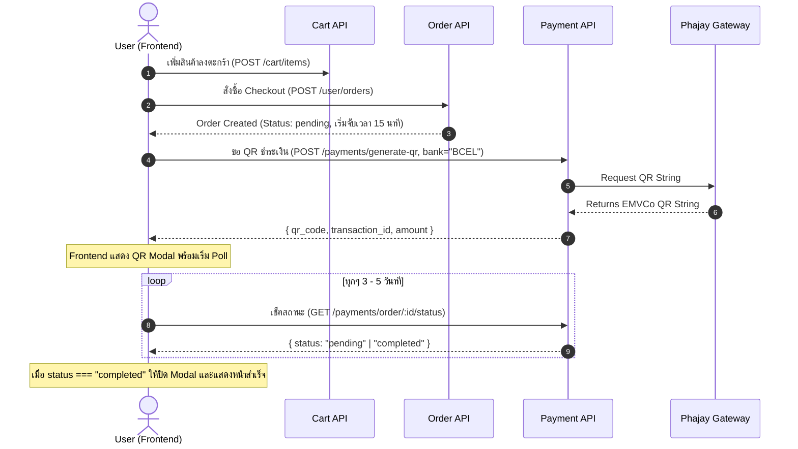

# 🛒 E-Commerce API Documentation (v2.0)
> **สำหรับทีม Frontend (Frontend Integration & Management Guide)**  
> Monorepo Role-Based Microservices API (Customer, Seller, Admin)

---

## 📌 1. ภาพรวมระบบ & การเชื่อมต่อ (Overview & Base URL)

ระบบใช้ Go (Fiber v3) และจัดโครงสร้างตาม Portal แยกตาม Role ชัดเจน:
- **Base URL**: `http://localhost:3000/api/v2`
- **Default Port**: `3000` (อ้างอิงจาก `.env`)
- **Format**: `JSON` (ยกเว้น Upload Image ใช้ `multipart/form-data`)
- **Content-Type**: `application/json`

### 🌐 Interactive Swagger UI (ทดสอบ API สดได้ทันที)
Backend ได้แยก Swagger Docs ออกเป็น 3 Portals เพื่อความสะดวก:
| Portal | Swagger UI URL |
| :--- | :--- |
| 🛍️ **Customer (User) Portal** | [http://localhost:3000/swagger/user/index.html](http://localhost:3000/swagger/user/index.html) |
| 🏪 **Seller Portal** | [http://localhost:3000/swagger/seller/index.html](http://localhost:3000/swagger/seller/index.html) |
| 🛡️ **Admin Portal** | [http://localhost:3000/swagger/admin/index.html](http://localhost:3000/swagger/admin/index.html) |

---

## 🔐 2. การจัดการ Authentication & Authorization

### 2.1 โครงสร้าง Token
ระบบใช้ **JWT (JSON Web Token)** แบบ Dual-Token:
- **`access_token`**: มีอายุ **15 นาที** (ส่งใน Request Header ทุกครั้งที่เรียก Private API)
- **`refresh_token`**: มีอายุ **7 วัน (168 ชม.)** (ใช้ขอ Access Token ใหม่เมื่อ Token เก่าหมดอายุ)

### 2.2 Header Format
สำหรับ Endpoint ที่ต้อง Login ให้แนบ Header:
```http
Authorization: Bearer <access_token>
```

### 2.3 Role & Permissions
| Role | สิทธิ์การเข้าถึง |
| :--- | :--- |
| `user` | สั่งซื้อสินค้า, จัดการตะกร้า, ชำระเงินผ่าน Phajay QR / Link, ดูประวัติคำสั่งซื้อ |
| `seller` | จัดการสต็อกสินค้าของตัวเอง, อัปโหลดรูปภาพสินค้า, ดูคำสั่งซื้อที่มีสินค้าของตน, อัปเดตสถานะจัดส่ง |
| `admin` | จัดการผู้ใช้ทั้งหมด (เพิ่ม/ลบ), จัดการหมวดหมู่สินค้า, ดูและอัปเดต Order ทั้งระบบ |

---

## ⚠️ 3. มาตรฐาน Response & Error Format

### 3.1 สำเร็จ (Success)
- `200 OK` หรือ `201 Created`
- ส่งข้อมูล JSON Object หรือ Array กลับมาโดยตรง

### 3.2 ข้อผิดพลาด (Error)
เมื่อเกิดข้อผิดพลาด API จะส่ง status `400`, `401`, `403`, `404`, `500` ในรูปแบบ:
```json
{
  "error": "คำอธิบายข้อผิดพลาดที่เกิดขึ้น"
}
```

---

## 📱 4. CUSTOMER PORTAL (`/api/v2/user`)

### 4.1 Authentication (ไม่ต้องแนบ Token)

#### [POST] `/api/v2/user/register` - สมัครสมาชิก
- **Request Body**:
  ```json
  {
    "email": "customer@example.com",
    "password": "password123"
  }
  ```
- **Response (201 Created)**:
  ```json
  {
    "access_token": "eyJhbGciOi...",
    "refresh_token": "eyJhbGciOi...",
    "user_id": "018f...",
    "email": "customer@example.com",
    "roles": ["user"]
  }
  ```

#### [POST] `/api/v2/user/login` - เข้าสู่ระบบ
- **Request Body**:
  ```json
  {
    "email": "customer@example.com",
    "password": "password123"
  }
  ```
- **Response (200 OK)**: เหมือน Register

#### [POST] `/api/v2/user/refresh` - ขอ Access Token ใหม่
- **Request Body**:
  ```json
  {
    "refresh_token": "eyJhbGciOi..."
  }
  ```
- **Response (200 OK)**: ได้ Access Token และ Refresh Token ชุดใหม่

#### [POST] `/api/v2/user/logout` - ออกจากระบบ
- **Request Body**:
  ```json
  {
    "refresh_token": "eyJhbGciOi..."
  }
  ```
- **Response (200 OK)**:
  ```json
  {
    "message": "Successfully logged out"
  }
  ```

---

### 4.2 Products & Catalog (Public - ไม่ต้องแนบ Token)

#### [GET] `/api/v2/user/products` - ดูรายการสินค้าทั้งหมด
- **Response (200 OK)**:
  ```json
  [
    {
      "id": "prod-123",
      "seller_id": "seller-001",
      "category_id": "cat-001",
      "name": "Wireless Mouse RGB",
      "description": "Ergonomic gaming mouse",
      "price": 490.00,
      "stock": 25,
      "image_url": "https://...supabase.co/...",
      "created_at": "2026-10-06T12:00:00Z",
      "updated_at": "2026-10-06T12:00:00Z"
    }
  ]
  ```

#### [GET] `/api/v2/user/products/:id` - ดูรายละเอียดสินค้าตาม ID
- **Params**: `id` (string)
- **Response (200 OK)**: Object ของ Product เดียวกัน

#### [GET] `/api/v2/user/categories` - ดูหมวดหมู่สินค้าทั้งหมด
- **Response (200 OK)**:
  ```json
  [
    {
      "id": "cat-001",
      "name": "Electronics",
      "created_at": "2026-10-06T10:00:00Z",
      "updated_at": "2026-10-06T10:00:00Z"
    }
  ]
  ```

#### [GET] `/api/v2/user/products/seller/:sellerId` - ดูสินค้าเฉพาะร้านค้านี้
- **Params**: `sellerId` (string)
- **Response (200 OK)**: Array ของ Product

---

### 4.3 Shopping Cart (ต้องแนบ Bearer Token)

#### [GET] `/api/v2/user/cart` - ดึงข้อมูลตะกร้าสินค้าปัจจุบัน
- **Response (200 OK)**:
  ```json
  {
    "id": "cart-uuid",
    "user_id": "user-uuid",
    "items": [
      {
        "id": "item-uuid",
        "cart_id": "cart-uuid",
        "product_id": "prod-123",
        "product": {
          "id": "prod-123",
          "name": "Wireless Mouse RGB",
          "price": 490.00,
          "image_url": "https://...",
          "stock": 25
        },
        "quantity": 2,
        "created_at": "2026-10-06T12:30:00Z",
        "updated_at": "2026-10-06T12:30:00Z"
      }
    ],
    "created_at": "2026-10-06T12:00:00Z",
    "updated_at": "2026-10-06T12:30:00Z"
  }
  ```

#### [POST] `/api/v2/user/cart/items` - เพิ่มสินค้าลงตะกร้า
- **Request Body**:
  ```json
  {
    "product_id": "prod-123",
    "quantity": 1
  }
  ```
- **Response (200 OK)**: คืนข้อมูล Cart ที่อัปเดตแล้ว

#### [PUT] `/api/v2/user/cart/items/:productId` - แก้ไขจำนวนสินค้าในตะกร้า
- **Params**: `productId`
- **Request Body**:
  ```json
  {
    "quantity": 3
  }
  ```
- **Response (200 OK)**: คืนข้อมูล Cart ที่อัปเดตแล้ว

#### [DELETE] `/api/v2/user/cart/items/:productId` - ลบสินค้าชิ้นนั้นออกจากตะกร้า
- **Response (200 OK)**: คืนข้อมูล Cart ที่อัปเดตแล้ว

#### [DELETE] `/api/v2/user/cart` - ล้างสินค้าทั้งหมดในตะกร้า
- **Response (200 OK)**:
  ```json
  {
    "message": "Cart cleared successfully"
  }
  ```

---

### 4.4 Orders & Checkout (ต้องแนบ Bearer Token)

> 💡 **ข้อควรรู้สำคัญสำหรับ Frontend:**
> 1. เมื่อสั่ง `POST /user/orders` ระบบจะตัดสินค้าจากตะกร้ามาสร้าง Order, ล้างตะกร้า และ **จองสต็อกสินค้าทันที** (สถานะ: `pending`)
> 2. **Auto-Cancel Worker (15 นาที)**: เซิร์ฟเวอร์มี Background Worker คอยตรวจสอบคำสั่งซื้อที่ค้างชำระเกิน 15 นาที ระบบจะยกเลิกอัตโนมัติ (`cancelled`) และ **คืนสต็อกสินค้าให้ร้านค้า**
> 3. หน้า Frontend ควรมีตัวเลขนับถอยหลัง (Timer 15 นาที) แจ้งเตือนผู้ใช้ในการชำระเงิน

#### [POST] `/api/v2/user/orders` - ทำการสั่งซื้อ (Checkout จากตะกร้า)
- **Request Body**:
  ```json
  {
    "phone_number": "020-5555-9999",
    "logistic_company": "Anousith Express",
    "logistic_branch": "Vientiane Main",
    "district": "Chanthabouly"
  }
  ```
- **Response (201 Created)**:
  ```json
  {
    "id": "order-9988",
    "user_id": "user-uuid",
    "total_amount": 980.00,
    "status": "pending",
    "phone_number": "020-5555-9999",
    "logistic_company": "Anousith Express",
    "logistic_branch": "Vientiane Main",
    "district": "Chanthabouly",
    "order_items": [
      {
        "id": "item-1",
        "order_id": "order-9988",
        "product_id": "prod-123",
        "product": {
          "id": "prod-123",
          "name": "Wireless Mouse RGB",
          "price": 490.00,
          "image_url": "https://...",
          "stock": 23
        },
        "quantity": 2,
        "price": 490.00
      }
    ],
    "created_at": "2026-10-06T15:00:00Z",
    "updated_at": "2026-10-06T15:00:00Z"
  }
  ```

#### [GET] `/api/v2/user/orders` - ดูประวัติการสั่งซื้อของผู้ใช้
- **Response (200 OK)**: Array ของ Order

#### [GET] `/api/v2/user/orders/:id` - ดูรายละเอียด Order ตาม ID
- **Response (200 OK)**: Object ของ Order

#### [POST] `/api/v2/user/orders/:id/cancel` - ผู้ใช้ยกเลิก Order (คืนสต็อกสินค้า)
- **Response (200 OK)**:
  ```json
  {
    "message": "Order cancelled successfully and stock restored"
  }
  ```

---

### 4.5 Payments (Phajay Gateway - ต้องแนบ Bearer Token)

ระบบมี 2 ทางเลือกในการชำระเงิน:
1. **Direct QR Code (แนะนำ)**: สร้าง QR Code มาแสดงบน Modal ทันที ไม่ต้อง Redirect ออกนอกเว็บ พร้อมระบบ Polling เช็คผล
2. **Redirect URL (Legacy)**: Redirect ผู้ใช้ไปยังหน้าเว็บ Gateway ของ Phajay

#### [POST] `/api/v2/user/payments/generate-qr` - สร้าง QR Code ชำระเงิน (แนะนำ ⭐)
- **Request Body**:
  ```json
  {
    "order_id": "order-9988",
    "bank": "BCEL"
  }
  ```
  *(หมายเหตุ: `bank` สามารถเลือกได้: `"BCEL"`, `"JDB"`, `"LDB"`, `"IB"`, `"STB"`, `"MMONEY"` ค่าเริ่มต้นคือ `"BCEL"`)*
- **Response (201 Created)**:
  ```json
  {
    "payment_id": "pay-001",
    "order_id": "order-9988",
    "amount": 980.00,
    "status": "pending",
    "transaction_id": "TXN-PHAJAY-12345",
    "qr_code": "00020101021230670016A0000007270...",
    "deep_link": "bcelone://qr/pay?data=..."
  }
  ```
  *(Frontend สามารถเอาสตริง `qr_code` ไป render ผ่านไลบรารี مثل `qrcode.react` หรือ `canvas` ได้เลย)*

#### [GET] `/api/v2/user/payments/order/:orderId/status` - ตรวจสอบสถานะการจ่ายเงิน (Polling)
- เรียก API นี้ทุกๆ 3 - 5 วินาที ขณะที่เปิดหน้าต่างแสดง QR Code
- **Response (200 OK)**:
  ```json
  {
    "payment_id": "pay-001",
    "order_id": "order-9988",
    "amount": 980.00,
    "status": "completed",
    "transaction_id": "TXN-PHAJAY-12345",
    "qr_code": "0002010102123067..."
  }
  ```
  *(เมื่อ `status === "completed"` Frontend ปิด Modal และเปลี่ยนหน้าไปยังหน้า Payment Success ได้ทันที)*

#### [POST] `/api/v2/user/payments` - สร้าง Payment Redirect URL
- **Request Body**:
  ```json
  {
    "order_id": "order-9988"
  }
  ```
- **Response (201 Created)**:
  ```json
  {
    "payment_id": "pay-001",
    "order_id": "order-9988",
    "amount": 980.00,
    "status": "pending",
    "payment_url": "https://pay.phajay.com/checkout/..."
  }
  ```

#### [GET] `/api/v2/user/payments/order/:orderId` - ดูข้อมูลประวัติการชำระเงินของ Order
- **Response (200 OK)**:
  ```json
  {
    "id": "pay-001",
    "order_id": "order-9988",
    "method": "qr_code",
    "qr_code": "00020101...",
    "transaction_id": "TXN-PHAJAY-12345",
    "amount": 980.00,
    "status": "completed",
    "created_at": "2026-10-06T15:05:00Z"
  }
  ```

---

## 🏪 5. SELLER PORTAL (`/api/v2/seller`)

### 5.1 Authentication (Seller Role)
- `POST /api/v2/seller/login`: บัญชีต้องมี role `seller` หรือ `admin` มิฉะนั้นจะตอบกลับ `403 Forbidden`
- `POST /api/v2/seller/refresh`
- `POST /api/v2/seller/logout`

---

### 5.2 Product Management (ต้องแนบ Bearer Token + Role: `seller`)

#### [POST] `/api/v2/seller/products/upload-image` - อัปโหลดรูปภาพสินค้า (Supabase)
- **Content-Type**: `multipart/form-data`
- **Form Data Field**: `image` (File binary: PNG, JPG, WebP)
- **Response (200 OK)**:
  ```json
  {
    "image_url": "https://bmiqpmqwavddtimemvrt.supabase.co/storage/v1/object/public/Prodocts/products/1728231234-photo.png"
  }
  ```
  *(นำ `image_url` นี้ไปใส่ในฟิลด์ `image_url` ตอนสร้างหรือแก้สินค้า)*

#### [POST] `/api/v2/seller/products` - เพิ่มสินค้าใหม่
- **Request Body**:
  ```json
  {
    "category_id": "cat-001",
    "name": "Mechanical Keyboard RGB",
    "description": "Hot-swappable switches, wireless 2.4G",
    "price": 1290.00,
    "stock": 50,
    "image_url": "https://...supabase.co/..."
  }
  ```
- **Response (201 Created)**: ข้อมูล Product ที่สร้างเสร็จ

#### [GET] `/api/v2/seller/products` - ดูรายการสินค้าของร้านตนเอง
- **Response (200 OK)**: Array ของ Product ที่ Seller คนนี้เป็นเจ้าของ (`seller_id`)

#### [PUT] `/api/v2/seller/products/:id` - อัปเดตข้อมูลสินค้า
- **Request Body**:
  ```json
  {
    "category_id": "cat-001",
    "name": "Mechanical Keyboard RGB (V2)",
    "description": "Updated switches",
    "price": 1190.00,
    "stock": 45,
    "image_url": "https://..."
  }
  ```
- **Response (200 OK)**: ข้อมูล Product ที่อัปเดตแล้ว

#### [DELETE] `/api/v2/seller/products/:id` - ลบสินค้าของร้านตนเอง
- **Response (200 OK)**:
  ```json
  {
    "message": "Product deleted successfully"
  }
  ```

#### [POST] `/api/v2/seller/categories` - สร้างหมวดหมู่สินค้า
- **Request Body**:
  ```json
  {
    "name": "Gaming Accessories"
  }
  ```
- **Response (201 Created)**: Category Object

---

### 5.3 Order Management for Seller (ต้องแนบ Bearer Token + Role: `seller`)

#### [GET] `/api/v2/seller/orders` - ดูรายการคำสั่งซื้อของร้านตนเอง
- คืนค่ารายการคำสั่งซื้อที่มีสินค้าของร้านนี้บรรจุอยู่
- **Response (200 OK)**: Array ของ Order

#### [PUT หรือ PATCH] `/api/v2/seller/orders/:id/status` - อัปเดตสถานะคำสั่งซื้อ
- **Request Body**:
  ```json
  {
    "status": "processing"
  }
  ```
  *(ค่า status ที่รองรับ: `"pending"`, `"processing"`, `"shipped"`, `"completed"`, `"cancelled"`)*
- **Response (200 OK)**:
  ```json
  {
    "message": "Order status updated successfully"
  }
  ```

---

## 🛡️ 6. ADMIN PORTAL (`/api/v2/admin`)

### 6.1 Authentication (Admin Role)
- `POST /api/v2/admin/login`: บัญชีต้องมี role `admin`
- `POST /api/v2/admin/refresh`
- `POST /api/v2/admin/logout`

---

### 6.2 User Management (ต้องแนบ Bearer Token + Role: `admin`)

#### [POST] `/api/v2/admin/users` - สร้างผู้ใช้งานใหม่ (กำหนด Role ได้)
- **Request Body**:
  ```json
  {
    "email": "partner_store@store.com",
    "password": "strongPassword123",
    "role": "seller"
  }
  ```
  *(ค่า `role` ที่ระบุได้: `"user"`, `"seller"`, `"admin"`)*
- **Response (201 Created)**: AuthResponse

#### [GET] `/api/v2/admin/users` - รายชื่อผู้ใช้ทั้งหมดในระบบ
- **Response (200 OK)**: Array ของ User ทั้งหมด

#### [GET] `/api/v2/admin/users/:id` - ดูข้อมูลผู้ใช้ตาม ID
- **Response (200 OK)**: User Object

#### [DELETE] `/api/v2/admin/users/:id` - ลบผู้ใช้งาน
- **Response (200 OK)**:
  ```json
  {
    "message": "User deleted successfully"
  }
  ```

---

### 6.3 Admin Category & Order Management
- `POST /api/v2/admin/categories`: สร้างหมวดหมู่ `{ "name": "New Category" }`
- `GET /api/v2/admin/orders`: ดูรายการคำสั่งซื้อทั้งหมดทุกร้านในระบบ
- `PATCH /api/v2/admin/orders/:id/status`: ปรับสถานะคำสั่งซื้อใดๆ ในระบบ `{ "status": "shipped" }`

---

## 🔔 7. WEBHOOKS (External Services)
- `POST /api/v2/webhooks/phajay` หรือ `POST /api/v2/user/payments/webhook`
  - ใช้สำหรับให้ Phajay Server ยิง callback แจ้งสถานะการชำระเงิน
  - ระบบจะตรวจสอบธุรกรรมและอัปเดต Order เป็น `completed` อัตโนมัติ

---

## 💻 8. TypeScript Types & Interfaces (สำหรับ Frontend Copy ไปใช้ได้เลย)

```typescript
// types/api.ts

export type UserRole = 'user' | 'seller' | 'admin';

export interface AuthResponse {
  access_token: string;
  refresh_token: string;
  user_id: string;
  email: string;
  roles: UserRole[];
}

export interface User {
  id: string;
  email: string;
  roles: UserRole[];
  created_at: string;
  updated_at: string;
}

export interface Category {
  id: string;
  name: string;
  created_at: string;
  updated_at: string;
}

export interface Product {
  id: string;
  seller_id: string;
  category_id?: string;
  name: string;
  description: string;
  price: number;
  stock: number;
  image_url: string;
  created_at: string;
  updated_at: string;
}

export interface CartProduct {
  id: string;
  name: string;
  price: number;
  image_url: string;
  stock: number;
}

export interface CartItem {
  id: string;
  cart_id: string;
  product_id: string;
  product?: CartProduct;
  quantity: number;
  created_at: string;
  updated_at: string;
}

export interface Cart {
  id: string;
  user_id: string;
  items: CartItem[];
  created_at: string;
  updated_at: string;
}

export type OrderStatus = 'pending' | 'processing' | 'shipped' | 'completed' | 'cancelled';

export interface OrderItem {
  id: string;
  order_id: string;
  product_id: string;
  product?: CartProduct;
  quantity: number;
  price: number;
}

export interface Order {
  id: string;
  user_id: string;
  total_amount: number;
  status: OrderStatus;
  phone_number?: string;
  logistic_company?: string;
  logistic_branch?: string;
  district?: string;
  order_items: OrderItem[];
  created_at: string;
  updated_at: string;
}

export type PaymentMethod = 'qr_code' | 'redirect';
export type PaymentStatus = 'pending' | 'completed' | 'failed';

export interface GenerateQRResponse {
  payment_id: string;
  order_id: string;
  amount: number;
  status: PaymentStatus;
  transaction_id: string;
  qr_code: string;
  deep_link?: string;
}

export interface PaymentStatusResponse {
  payment_id: string;
  order_id: string;
  amount: number;
  status: PaymentStatus;
  transaction_id?: string;
  qr_code?: string;
}

export interface ApiErrorResponse {
  error: string;
}
```

---

## ⚡ 9. Frontend Integration Flow & Best Practices

### 9.1 Axios Interceptor (Auto Refresh Token)
ตัวอย่างการเขียน Interceptor เพื่อ Refresh Token อัตโนมัติเมื่อเจอรหัส `401 Unauthorized`:

```typescript
// lib/apiClient.ts
import axios from 'axios';

export const api = axios.create({
  baseURL: 'http://localhost:3000/api/v2',
  headers: {
    'Content-Type': 'application/json',
  },
});

api.interceptors.request.use((config) => {
  const token = localStorage.getItem('access_token');
  if (token) {
    config.headers.Authorization = `Bearer ${token}`;
  }
  return config;
});

api.interceptors.response.use(
  (response) => response,
  async (error) => {
    const originalRequest = error.config;
    if (error.response?.status === 401 && !originalRequest._retry) {
      originalRequest._retry = true;
      const refreshToken = localStorage.getItem('refresh_token');
      if (refreshToken) {
        try {
          const { data } = await axios.post('http://localhost:3000/api/v2/user/refresh', {
            refresh_token: refreshToken,
          });
          localStorage.setItem('access_token', data.access_token);
          localStorage.setItem('refresh_token', data.refresh_token);
          originalRequest.headers.Authorization = `Bearer ${data.access_token}`;
          return api(originalRequest);
        } catch (refreshErr) {
          localStorage.clear();
          window.location.href = '/login';
        }
      }
    }
    return Promise.reject(error);
  }
);
```

### 9.2 Checkout & Phajay QR Payment Workflow

